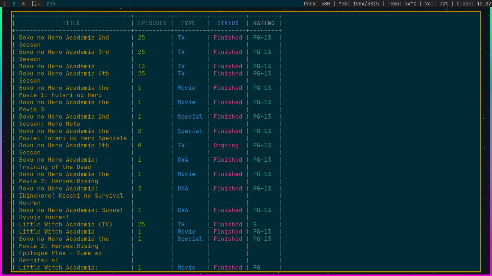
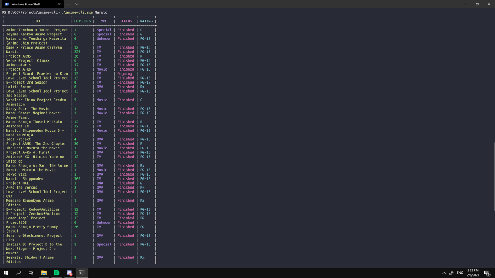

<div align="center">
<h1>anime-cli</h1>
</div>

<div style="display:flex; flex:1;">





</div>

## A simple app for fetching data about animes

This app is written in Go, so the only dependency is the Go compiler. 
This project is heavily inspired by [Genzyy's anime-cli](https://github.com/genzyy/anime-cli), but it involved including also a module for manga.

You can import the [anime module](https://github.com/DarkWarrior703/anime-cli/anime) or the [manga module](https://github.com/DarkWarrior703/anime-cli/manga) for your GO app.

## Installing
Simple as 
```
go install
```

This will place the binary where $GOBIN indicates to.
By default,
```
$GOBIN=$GOPATH/bin 
```

If you wanna install it in a specific directory, change the GOBIN variable
```
GOBIN=$PATH go install
```

## Usage

```
anime-cli <command> query
```
where _command_ is either 'anime' or 'manga' and _query_ is the name of anime/manga.

It will display a table containing info about the animes/mangas that contain the _query_.
